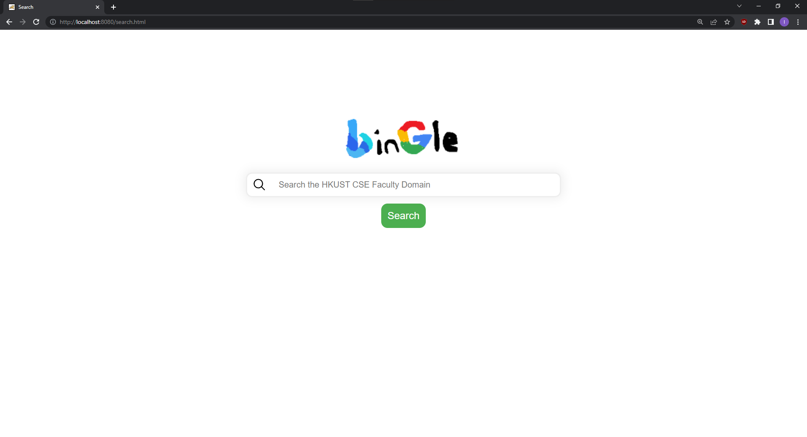
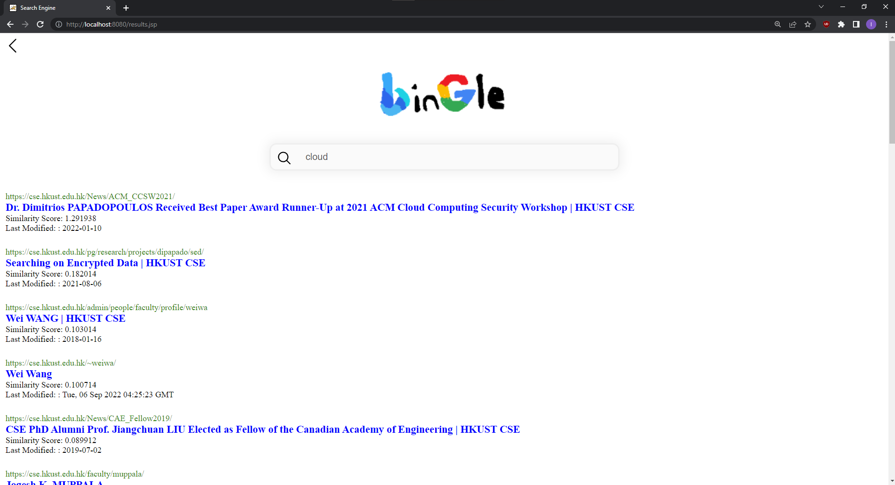
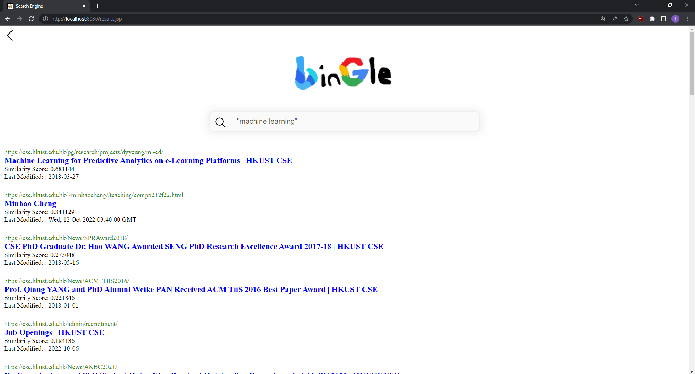

# Java Search Engine

Welcome to the Java Search Engine! This project was created for the Search Engines course at HKUST (COMP4321).

Here is a demo of the search engine in action:


## Home Page

## Sample Search Page


## Exact phrasal match


## Installation (Windows)

1. Install Apache Tomcat 9 & Maven (you should be able to use the `mvn` command)
2. Clone this repository
3. Navigate to Apache Software Foundation directory (default: C:\Program Files\Apache Software Foundation), You should see the Tomcat directory here
4. Move the cloned folder into the Apache Software Foundation directory (ignoring the ROOT folder), so that there are two folders, the tomcat and the comp4321project... folder
5. Move the ROOT folder into the tomcat's webapps folder, replacing the original ROOT folder inside.
6. Navigate to the comp4321project... folder and make sure that line 101 of pom.xml contains the ...
7. run these two commands

```
mvn clean package
mvn exec:java
```

8. Finally, navigate to the tomcat/bin folder and run Tomcat9.exe. This will allow you to access localhost:8080/search.html
